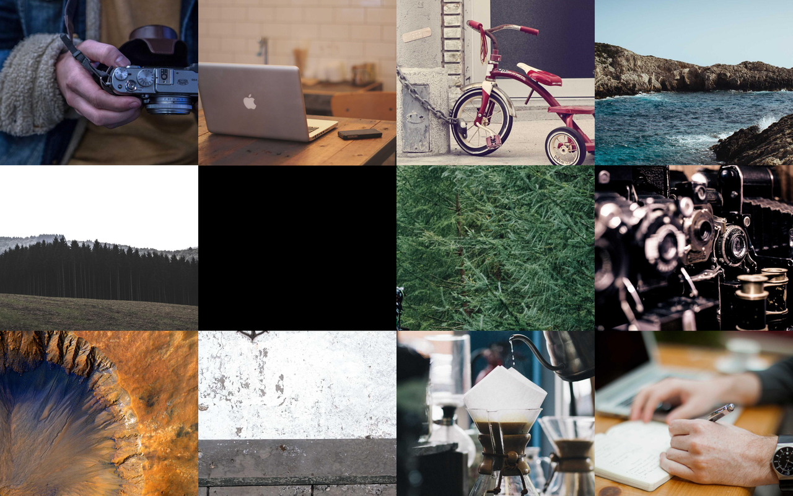
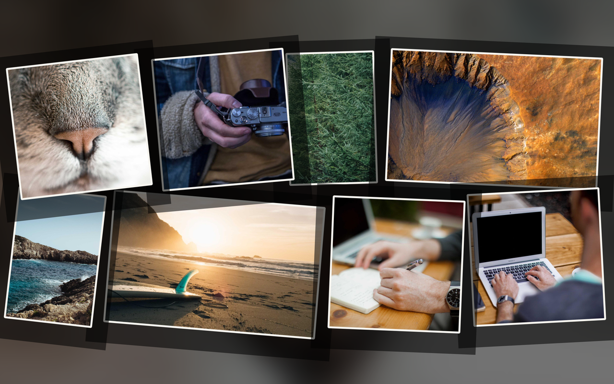
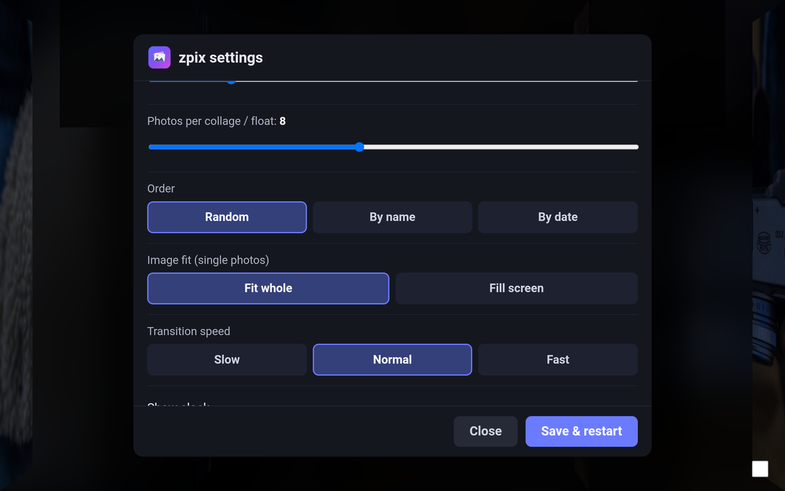
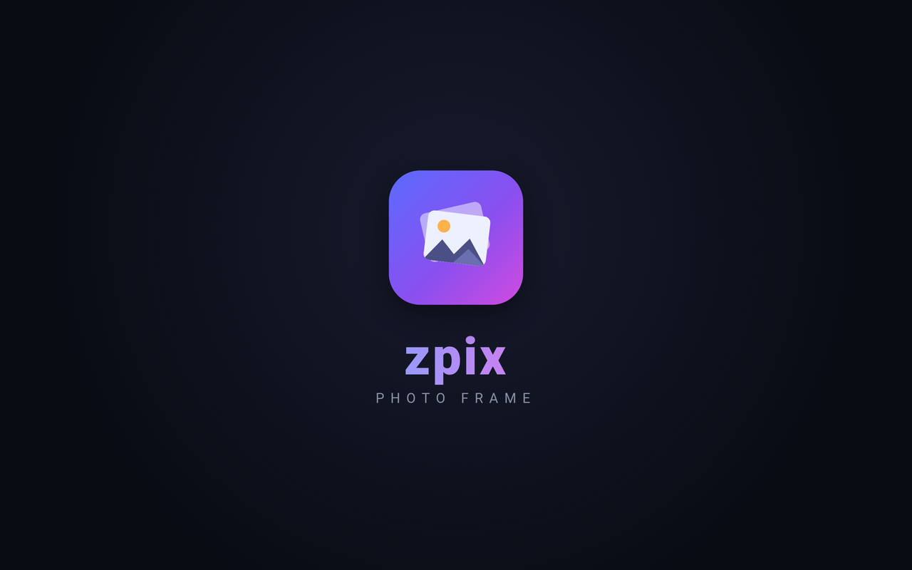

<p align="center">
  
</p>

<h1 align="center">zpix</h1>

<p align="center">A simple, fully-offline digital <b>photo frame</b> for Android — give an old tablet a second life.</p>

---

zpix turns an old Android tablet into an always-on photo frame. No accounts, no cloud, no ads, no nag screens — it just shows your photos with nice transitions. It's a tiny native shell hosting a WebView, with the slideshow engine written in plain HTML/CSS/JS.

## Tested on

- **Samsung Galaxy Tab Pro 12.2 (SM-T900)**, **Android 5.1.1 (API 22)**.
- Built for **Android 5.1+ (API 22 and up)**.

## Features

- **Offline & local** — plays photos straight from folders on the device; no network needed.
- **Transitions** — Ken Burns, crossfade, slide, scattered collage, floating photos, origami grid (tiles fold to new photos), Polaroid stack, magazine layout, filmstrip scroll, reveal blinds, and cube turn. Each is toggleable.
- **Settings** (tap the screen) — multiple photo folders (with an in-app folder browser), seconds per photo, photos per collage, photo size, order (random / name / date), image fit, transition speed, clock and date overlays (US format), auto-start on boot, and per-transition toggles.
- **Upload from phone or laptop** — built-in upload server (port 8080, toggleable). Drop in single photos or a whole folder structure; on-page progress bar per file; a Browse tab to view / rename / delete / mkdir under the upload folder, with **Grid or List view**, sort by Name / Size / Date, and pagination for large libraries. See [Upload from phone or laptop](#upload-from-phone-or-laptop) below.
- **Always-on** — keeps the screen awake and auto-starts on boot.
- **Self-update** — checks GitHub Releases and installs new versions in place.

## Screenshots

<table>
  <tr>
    <td align="center"><br><sub>Origami grid (tiles fold to new photos)</sub></td>
    <td align="center"><br><sub>Floating photos</sub></td>
  </tr>
  <tr>
    <td align="center"><br><sub>Scattered collage</sub></td>
    <td align="center"><br><sub>Settings</sub></td>
  </tr>
  <tr>
    <td align="center" colspan="2"><br><sub>Splash screen</sub></td>
  </tr>
</table>

<sub>Screenshots use royalty-free placeholder photos.</sub>

## Install

Download the latest `zpix-vX.Y.Z.apk` from [Releases](https://github.com/Pr0zak/zpix/releases), then:

```bash
adb install -r zpix-*.apk
```

Put some photos on the device (e.g. `/sdcard/Pictures`). On first run zpix uses the folder with the most photos; tap the screen to open Settings and pick your folder. On Android 5.1 you must allow **Unknown sources** for the in-app updater to install.

## Upload from phone or laptop

Enable **Upload server** in Settings. The tablet shows its address (e.g. `http://10.0.0.89:8080`) — open it from any device on the same Wi-Fi.

- **Upload tab** — tap to pick photos, tap to pick a whole folder, or drag and drop. Folder structure is preserved on the tablet. Each file gets its own progress bar; the queue collapses completed rows automatically so it stays usable with thousands of files. Live storage gauge at the top.
- **Browse tab** — manages everything that has been uploaded.
  - **Grid / List** view toggle.
  - Sort by **Name / Size / Date** with asc/desc.
  - Pagination at 100 items/page (`« First | ‹ Prev | 1–100 of 4218 · page 1/43 | Next › | Last »`).
  - Per-item **Rename**, multi-select **Delete**, and **New folder**.
  - Click a folder to drill in; the breadcrumb bar walks back out.

Everything stays on the LAN — there is no cloud, no account, and no listening port unless you explicitly enable the upload server.

## Build from source

No Gradle — the app has zero third-party dependencies.

```bash
./build.sh        # aapt2 -> javac -> d8 -> zipalign -> apksigner
python3 gen_icon.py   # regenerate the launcher icon (optional)
```

Needs a JDK and the Android SDK (`build-tools` + a platform `android.jar`); output is `build/zpix.apk`. Tagging `vX.Y.Z` builds a signed APK and publishes a Release via GitHub Actions.

## Layout

```
AndroidManifest.xml
src/com/zand/frame/   MainActivity.java (WebView shell + folder / update / upload bridge)
                      UploadServer.java (HTTP server for upload + browse)
                      BootReceiver.java
assets/               index.html, app.js (slideshow engine), style.css, logo.svg
                      uploader.html (upload + browse web UI)
res/                  strings + launcher icons
build.sh, gen_icon.py
```
